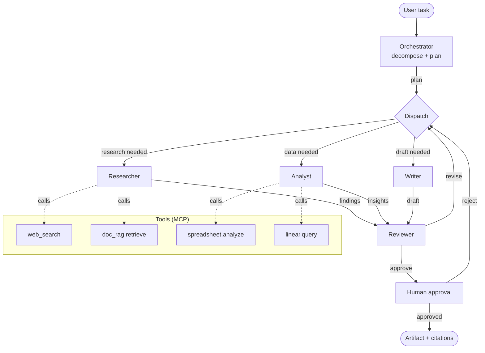

# Architecture — pm-copilot

## Graph



## State (LangGraph)

```python
class GraphState(TypedDict):
    task: str
    plan: list[Step]
    findings: list[Finding]
    analysis: list[Insight]
    draft: str | None
    review: ReviewVerdict | None
    iterations: int  # capped at 8
    budget_spent_usd: float  # capped at 0.50
    human_approved: bool
```

## Guardrails

- **Iteration cap** — 8 dispatches per task
- **Budget cap** — $0.50 default (configurable)
- **Tool timeout** — 30s per tool call
- **Retry** — exponential backoff on tool errors, max 3 retries
- **Human gate** — mandatory before "publish" actions (send email, file ticket)

## Observability

Every node emits a Langfuse trace with:
- Inputs/outputs (scrubbed of PII)
- Tokens + cost
- Latency
- Errors
- Tool calls

## Dual MCP

- **Consumer:** copilot's tools are MCP-backed (doc-rag, web search)
- **Provider:** `python -m pm_copilot.mcp.server` exposes the whole copilot as an MCP tool so Claude Desktop can invoke `pm_copilot.do_task(...)`
