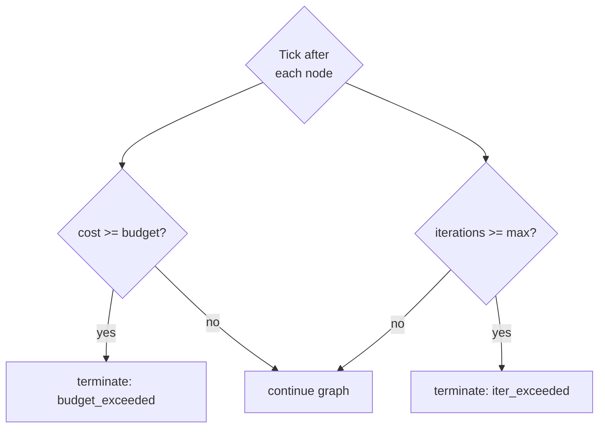
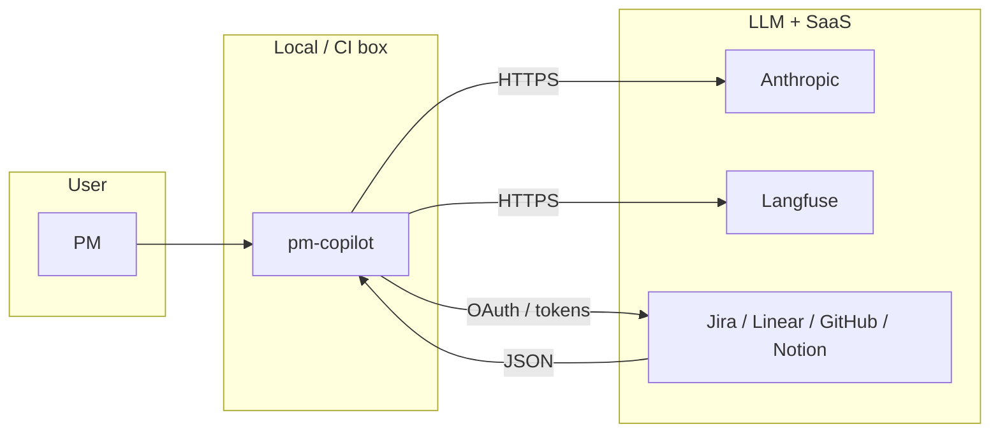

# DFD — pm-copilot

## Level 0 — Context

```mermaid
flowchart LR
  PM[PM / APM / founder]
  TOOLS[External systems<br/>Jira / Linear / GitHub / Notion / Web]
  LLM[LLM providers<br/>Anthropic]
  LF[Langfuse]
  PMC((pm-copilot))
  CD[Claude Desktop / other MCP clients]

  PM -- CLI / config / --apply --> PMC
  PMC -- tool calls --> TOOLS
  TOOLS -- JSON --> PMC
  PMC -- prompts --> LLM
  LLM -- completions --> PMC
  PMC -- traces --> LF
  CD -- MCP tool calls --> PMC
  PMC -- artefact.md --> PM
```

## Level 1 — Graph + supervisor

```mermaid
flowchart TD
  subgraph Orchestration
    P[1.0 Planner]
    R[1.1 Researcher]
    D[1.2 Drafter]
    V[1.3 Reviewer]
    F[1.4 Finaliser]
    S[1.5 Supervisor<br/>budget + iter caps]
  end

  subgraph ToolLayer
    TR[2.0 Tool registry]
    JI[2.1 Jira client]
    LN[2.2 Linear client]
    GH[2.3 GitHub client]
    NO[2.4 Notion client]
    WS[2.5 Web search]
    FS[2.6 Filesystem]
  end

  subgraph LLMLayer
    AC[3.0 Anthropic client<br/>mix-of-models]
    CM[3.1 Cost meter]
    PC[3.2 Prompt cache]
  end

  subgraph Observ
    LF[Langfuse]
    JSONL[Local JSONL fallback]
  end

  subgraph Surface
    CLI[CLI (Typer)]
    MCP[MCP server]
  end

  CLI --> P
  MCP --> P
  P --> R
  P --> D
  R --> TR
  D --> AC
  P --> AC
  V --> AC
  TR --> JI & LN & GH & NO & WS & FS
  AC --> CM
  AC --> PC
  S --> P & R & D & V
  P & R & D & V --> LF
  LF -. fallback .- JSONL
  V --> F --> CLI
  V --> F --> MCP
```

## Level 2 — `draft-prd` run

```mermaid
sequenceDiagram
  autonumber
  participant U as PM (CLI)
  participant O as Orchestrator (planner)
  participant R as Researcher
  participant T as Tool registry
  participant L as Anthropic
  participant S as Supervisor
  participant D as Drafter
  participant V as Reviewer
  participant F as Finaliser
  U->>O: draft-prd --issue LIN-482 --notes notes.md
  O->>L: plan(task) [Sonnet]
  L-->>O: plan[] (Steps)
  loop each step
    O->>R: execute(step)
    R->>T: linear.get_issue(LIN-482)
    T-->>R: issue JSON
    R->>L: summarise [Haiku]
    L-->>R: finding
    R-->>O: finding appended
    O->>S: tick
    alt budget or iter exceeded
      S-->>F: force-finalise(reason="capped")
    end
  end
  O->>D: compose(plan, findings)
  D->>L: draft PRD [Sonnet]
  L-->>D: draft markdown
  D->>V: review(draft)
  V->>L: critique [Sonnet; escalate to Opus if severe]
  L-->>V: verdict
  alt verdict.accept
    V->>F: finalise
    F-->>U: PRD.md
  else !accept && iterations < max
    V-->>D: request revisions
  end
```

## Level 2 — Supervisor kill-switch



## Data stores

| Store | Purpose | Retention |
|-------|---------|-----------|
| `.pm-copilot/runs/{run_id}/` | Per-run input, plan, findings, draft, trace JSONL | 30 days |
| Langfuse | Traces, spans, costs | Managed |
| Config YAML | Models, budgets, tool credentials | Repo or env |

## Trust boundaries



## Invariants

- No tool with side effects is called unless `--apply` is set.
- `state.cost_usd + est_cost <= state.budget_usd` must hold before every LLM call.
- Every node's output is JSON-schema-validated; invalid output forces one retry then abort.
- A finalised artefact is never silently overwritten; all writes are content-addressed.
- Langfuse trace id is written to `state.trace_id` in the first planner step.
