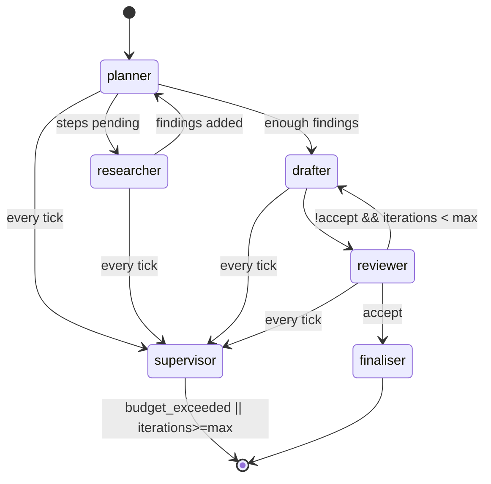

# RFC-001 — pm-copilot agent architecture

**Author:** Rushil Kaul · **Status:** Draft · **Target release:** P1–P2

## 1. Summary

Implement the copilot as a **LangGraph state machine** with an orchestrator node
that plans, dispatches to worker agents (researcher, drafter, reviewer), and
terminates on a reviewer verdict or a cap breach. Enforce budget and iteration
limits at the supervisor layer. Instrument every LLM/tool call with Langfuse.
Expose a thin MCP server so external agents can call our high-level tools.

## 2. Context

`RESEARCH.md` covers pattern choice (orchestrator-worker vs hierarchical
agent). `PRD.md` owns goals. This RFC pins the state shape, node contracts,
tool registry, and MCP surface.

## 3. Detailed design

### 3.1 Graph state

```python
# src/pm_copilot/graph/state.py
class Step(BaseModel):
    id: str
    description: str
    status: Literal["pending","in_progress","done","skipped"]

class Finding(BaseModel):
    source: str
    excerpt: str
    relevance: float

class ReviewVerdict(BaseModel):
    accept: bool
    critique: str
    missing: list[str] = []

class GraphState(BaseModel):
    task: str                               # user request
    plan: list[Step] = []
    findings: list[Finding] = []
    draft: str | None = None
    review: ReviewVerdict | None = None
    iterations: int = 0
    cost_usd: float = 0.0
    budget_usd: float = 0.5
    max_iterations: int = 8
    trace_id: str | None = None
```

### 3.2 Nodes

| Node | Role | Default model |
|------|------|---------------|
| `planner` | Produce/update `plan` given `task` and `findings` | Sonnet |
| `researcher` | Execute tool calls for a step; append to `findings` | Haiku |
| `drafter` | Write/update `draft` from `plan` + `findings` | Sonnet |
| `reviewer` | Return `ReviewVerdict` | Sonnet (escalate to Opus on critique>2) |
| `supervisor` | Budget / iteration enforcement; maybe-terminate | (deterministic) |
| `finaliser` | Produce the final artefact; format to markdown | Sonnet |

### 3.3 Transition diagram



### 3.4 Tool registry

```python
# src/pm_copilot/tools/registry.py
@dataclass
class ToolDef:
    name: str                               # e.g. "jira.get_issue"
    input_schema: dict                      # JSON schema
    output_schema: dict
    fn: Callable[[dict], Awaitable[dict]]
    cost_est_usd: float = 0.0               # optional cost estimate

REGISTRY: dict[str, ToolDef] = {}

def tool(name: str):
    def deco(fn):
        REGISTRY[name] = ToolDef(name=name, ...)
        return fn
    return deco
```

Core tools (P1): `jira.get_issue`, `jira.list_issues`, `linear.get_issue`,
`github.pr_diff`, `github.list_prs_in_range`, `notion.read_page`, `web.search`,
`fs.read_markdown`, `fs.write_markdown` (writes gated on `--apply`).

### 3.5 Budget enforcement

Every LLM call is wrapped:

```python
async def llm_call(prompt, model, state: GraphState) -> str:
    est_cost = estimate_cost(prompt, model)
    if state.cost_usd + est_cost > state.budget_usd:
        raise BudgetExceeded(state.cost_usd, state.budget_usd)
    result, usage = await anthropic.messages.create(...)
    state.cost_usd += usage.cost_usd
    langfuse.log(...)
    return result
```

The `supervisor` node checks `state.cost_usd` and `state.iterations` after every
step; on breach it forces the graph to `finaliser` (producing whatever draft
exists) and returns `reason="budget_exceeded"`.

### 3.6 Mix-of-models policy

```yaml
models:
  planner:    claude-3-5-sonnet
  researcher: claude-3-5-haiku        # cheap, fast, tool-heavy
  drafter:    claude-3-5-sonnet
  reviewer:   claude-3-5-sonnet
  escalator:  claude-3-opus           # invoked if reviewer.critique severity high
```

Upgradable via config; Langfuse records which model each node used for a run.

### 3.7 MCP server surface

Outbound (pm-copilot consumes): any MCP server registered by URL in config.

Inbound (pm-copilot exposes):

```python
@server.tool()
async def draft_prd(notes: str, ticket_id: str | None = None) -> str: ...
@server.tool()
async def release_notes(pr_range: str, audience: str = "customer") -> str: ...
@server.tool()
async def interview_synth(transcripts_dir: str) -> str: ...
```

### 3.8 Output contracts

Each artefact type has a JSON schema (subset shown):

```json
// PRD artefact
{
  "type": "object",
  "required": ["title","problem","goals","non_goals","questions_for_human"],
  "properties": {
    "title": {"type":"string"},
    "problem": {"type":"string"},
    "goals": {"type":"array","items":{"type":"string"}},
    "non_goals": {"type":"array","items":{"type":"string"}},
    "questions_for_human": {"type":"array","items":{"type":"string"}}
  }
}
```

Schemas live in `packages/pm_copilot/schemas/` and are enforced between nodes.

### 3.9 Observability

- Langfuse: one trace per run; spans for planner/researcher/drafter/reviewer.
- Local fallback: JSONL in `.pm-copilot/runs/{run_id}/trace.jsonl`.
- Cost + token counts bound to every LLM span.
- `pm-copilot runs list` / `inspect <run_id>` CLI.

## 4. Alternatives considered

| Alt | Why not |
|-----|---------|
| Single giant prompt (no graph) | Can't enforce budget mid-run; poor traceability |
| CrewAI / AutoGen | Fine frameworks; LangGraph's state model is closer to what we want |
| ReAct-only | No supervisor, no budget enforcement baked in |
| OpenAI Assistants API | Harder to trace granularly; model-lock in |
| DAG-style declarative (Airflow-ish) | Too rigid for planner iteration |

## 5. Tradeoffs

- LangGraph ergonomics are good but the runtime dependency surface is non-trivial;
  we pin versions carefully and add a smoke test on each upgrade.
- Per-node model pinning adds config surface; worth it for cost.
- JSON-schema validation between nodes adds latency (ms-scale) but prevents silent drift.

## 6. Rollout plan

1. P1 wk 1–2: Planner + researcher + drafter + reviewer graph for `draft-prd`.
2. P1 wk 3: Tool registry + Jira/GitHub/Notion tools + `--revise` loop.
3. P2 wk 4–5: `release-notes` + `interview-synth` + `status` commands.
4. P2 wk 6: MCP server (inbound + outbound).

## 7. Open questions

- Ship a scoring rubric checker as a standalone CLI? Probably.
- Do we persist `GraphState` snapshots per step for "step-forward / step-back"
  debugging? Great DX but heavy; consider for P3.
- Is there a minimal eval harness that compares two model configurations on
  the same task? Yes — committed to P3.
